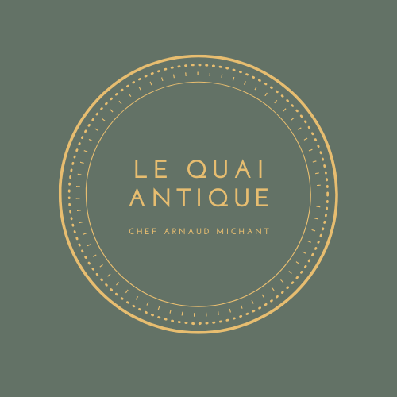

#  Le Quai Antique

## " Ceci est une application Symfony destinée à une évaluation de compétance. Elle est basée sur le framework Symfony 6 et une version PHP 8.1 "

## Installer l'application

### 1. Cloner le dépot git avec la comande

` git clone https://github.com/ElodieFon/quaiAntique.git `

### 2. Installer les dépandances PHP avec la comande

`composer install`

### 3. Configurer la base de donnée avec les comandes

(n'oubliez pas de configurer le .env pour votre propre bdd et votre smtp(pour l'envoie de mail))

`php bin/console doctrine:database:create`

`php bin/console doctrine:migrations:migrate`

: lancer les commande de l'étape  si dessou ,

### 4. Lancer le serveur avec la comande

`symfony server:start` ou

`symfony server:start -d` si vous voulais reprendre directement la main sur le terminal sans avoir à en changer.

### 5. Accédez à l'application en utilisant l'URL suivante

`http://localhost:8000`

### 6. création d’un administrateur

créer un utilisateur depui l'interface de l'aplication (inscription) modifier l'atribut roles depui la base de donnée [] => ["ROLE_ADMIN"]
pour accéder au tableau de bord ajouter /admin à l'url

## le Theme donée

### LE PROJET Restaurant

Le Chef Arnaud Michant aime passionnément les produits - et producteurs - de la Savoie.
C’est pourquoi il a décidé d’ouvrir son troisième restaurant dans ce département.

Le Quai Antique sera installé à Chambéry et proposera au déjeuner comme au dîner une
expérience gastronomique, à travers une cuisine sans artifice.

Plus encore que ses deux autres restaurants, Arnaud Michant le voit comme une promesse
d’un voyage dans son univers culinaire.

Lors de l’inauguration de son deuxième établissement, le chef Michant a pu constater
l’impact positif que pouvait avoir un bon site web sur son chiffre d’affaires. C’est pourquoi il
a fait appel à l’agence web dont vous faites partie.

Dans le cadre de cette mission qui vous est affectée, vous aurez à créer une application web
vitrine pour le Quai Antique avec ce goût de la qualité que recherche Arnaud Michant.

## Les functionalitées

### pour tous *

- voir les plats
- inscription
- loggin  
- envoie formulaire de contact

### uniquement pour le role user *

- envoie formulaire de reservation

### uniquement pour le role Admin *

- accé au dashboard "/admin"
- consulté , suprimer ou modifier les plats + possibiliter de rendre actif/inactif ou de metre en avant un plat sur la première page.
- consulté , suprimer ou modifier des catégorie pour les plat + possibiliter de rendre actif/inactif
- consulté , suprimer ou modifier les horaire de fermeture + possibiliter de rendre actif/inactif
- consulté , suprimer ou modifier des heure de reservation + possibiliter de rendre actif/inactif
- consulté , suprimer ou modifier le nombre de place possible sur les heure de reservation.
- consulté , suprimer ou modifier des reservations.
- consulté , suprimer ou modifier des article pour la page info
